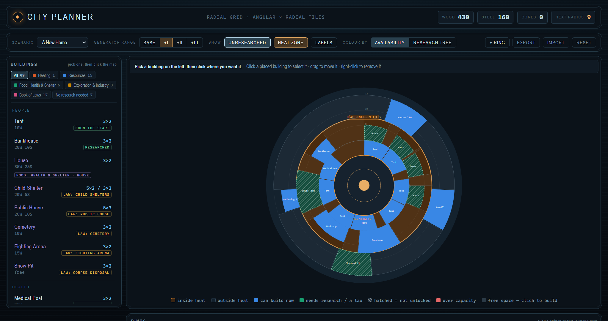

# Frostpunk — Hintforge Companion

*A planner built directly on this guide's building and research data: place buildings on the radial grid by angular footprint, see where heat actually stops, and reserve ring space for things you have not unlocked yet — with the full research chain each one really costs. It ships in this repo at [`artifacts/city_planner.html`](artifacts/city_planner.html) — download it and open it in any browser.*

A spoiler-controlled hint companion for **Frostpunk**, 11 bit studios' frostbitten survival city-builder where you keep the last city on Earth alive around a coal generator — and decide what a society will do to survive. Built in the [Hintforge](https://github.com/hintforge/builder) format: a loyal sidekick that answers only from these guide files — never from guesswork — at the spoiler level you set.

## Use it

You need a Hintforge reader running in Claude Code, Codex, or OpenClaw. Point it at this repo:

> Load the Frostpunk guide from github.com/hintforge/frostpunk

Then just ask — *"how do I keep heat up," "which law should I pass," "how does this scenario end."* Runtime setup lives in [`hintforge/reader`](https://github.com/hintforge/reader).

## Spoilers

**You** set two independent dials — enemy/threat warnings (Tier 0–5) and puzzle/decision warnings (Tier 0–3) — both **silent by default**; the guide volunteers nothing pre-emptively until you raise one. Late laws and scenario turns are spoiler-tiered, so they stay hidden until your dial allows. There's no save-state reader, so every answer comes from this guide's files.

## What's inside

A structured Markdown corpus — core systems (heat, economy, the Book of Laws), every scenario, the law paths, endings, and all achievements — plus the full base-game technology tree in [`items/upgrades.md`](items/upgrades.md), every node with its tier, prerequisite and wood/steel cost. That tree is what the city planner above is built on. The companion reads and writes only the files you control.

## City Planner

A self-contained planner built from this corpus — [`artifacts/city_planner.html`](artifacts/city_planner.html). Download it, open it in any browser, keep it beside the game. Nothing is installed and nothing leaves your machine.

Frostpunk builds on a **radial grid**, so a footprint is *angular × radial* tiles — width along the curve, then depth out from the generator. Space isn't an area budget, it's an **angular budget per ring** that grows as you move outward. The planner models that directly.

- **Place before you unlock.** Buildings you haven't researched drop onto the map as hatched *reserved space*, so you can hold the ground now and see what earning it will cost.
- **Reach cost.** The wiki prices the House tech at 40W/25S. Getting there means Bunkhouse first, and the Drawing Boards → Drafting Machines → Mechanical Calculators tier unlocks before that: **285W/110S**, 7.1× the sticker price. The planner computes that chain for every gated building and totals your whole plan.
- **Where heat actually stops.** The heat limit is a hard, labelled boundary — not a gradient — and it moves as you dial in generator range upgrades, showing how many more rings come inside.
- **The research is in the tool.** Filter buildings by Workshop tab (Heating · Resources · Food, Health & Shelter · Exploration & Industry · Book of Laws), and tick off what you've researched; ticking a node auto-ticks its prerequisites and the map and totals follow.

**It does not pretend to be tile-exact.** Ring capacity and the base heat radius are published nowhere, so the planner derives them and says so: against the one trustworthy community measurement it lands exactly on ring 1 and runs up to ~13% pessimistic further out. The wiki itself notes buildings "may slightly shrink or grow to accommodate their surroundings" — so if the game fits more than the planner says, the game is right, and every derived number is editable in the Model tab. Full detail in [`artifacts/README.md`](artifacts/README.md).
